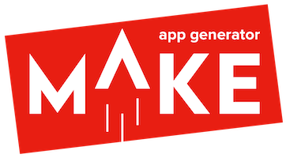

<p align="center"></p>
<h2 align="center">Everyday tools for simpler React Native development</h2>

## ⚙️ Setup

In your react-native project folder, run:

```bash
yarn add -D @bam.tech/react-native-make
# OR
npm i -D @bam.tech/react-native-make
```

**Please note:** This plugin only supports react-native-cli v2+

## 📚 Usage

Once installed, plugins are available through the React Native CLI

You can get the list of available plugins by running `react-native -h` within your project's folder

|                            Command | Description                               |
| ---------------------------------: | :---------------------------------------- |
|     [set-icon](./docs/set-icon.md) | generate platform specific app icons      |
| [set-splash](./docs/set-splash.md) | generate platform specific splash screens |

## 💻 Local development

- Pull latest version
- `cd react-native-make`
- Run `yarn` then `yarn link`
- Launch a new project with `react-native init`
- In your React Native project, `yarn link @bam.tech/react-native-make`
- In the package.json of your React Native project, in dependencies add "@bam.tech/react-native-make" : "0.0.0"

## Changes in 3.0.0

Since 3.0.0, splashscreens for iOS are created via Xcode’s storyboard, so as to meet Apple's new requirements as of April 2020.

**Disclaimer:** _To better understand your usage of this tool, basic analytics have been enabled. It only records commands usage as anonymous page views and does not identify users in any way_
